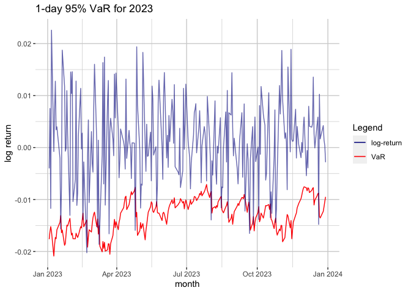

Single Asset and Multi-asset portfolio Value at Risk and Expected
shortfall estimation
================
Luca Albertini
2024-04-05

## Goal of the Project

The task-at-hand is to compute the Value at risk (VaR) and the expected
shortfall (ES) both for a single assets and a multi-asset portfolio.
Different methods will be employed, and all of them will be discussed
thoroughly. Finally, a 100 millions USD investment would be considered
and the possible losses according to VaR and ES computed.

## Definitions & Concepts

It is fundamental to have clear in mind the concepts for the analysis.
The main two are:

- *Value at Risk (VaR)*: is the amount that a portfolio may lose with a
  given probability (alpha) over a given time period. In other words, it
  is the maximum loss of the portfolio if the worst alpha percent of
  possible outcomes are excluded. As such, VaR has 3 elements:
  - a loss amount
  - a confidence level (1-alpha)
  - a time period
- *Expected Shortfall (ES)*: the expected shortfall, of an 1-alpha
  confidence interval and a given time period, is the expected return of
  the portfolio given that the return is worse than the associated VaR.
  Briefly, it is the expected return of the investment in the worst
  alpha-percent of cases.

As evident, VaR and ES are two extremely related concepts. As such, the
standard-procedure is to compute both of them while assessing the risks
of a portfolio (estimate first the VaR and then the ES). Different
methods, however, can be employed to guess these two measures of risk
based on the nature of the portfolio analyzed. These are:

- *Historical Method*: re-organize actual historical returns assuming
  story will repeat itself.
- *Variance-Covariance method*: assumes that returns are normally
  distributed and requires estimations for the expected return and
  standard deviation.
- *Monte Carlo Simulation*: it employs computational models to simulate
  possible returns over hundreds of thousands possible iterations.

For multi-day horizon, instead, there are different techniques. The one
implemented in this analysis are:

- simulate from the student-t
- simulate from the empirical distribution with IID
- simulate from the empirical distribution with Block draws

# Analysis

## Data Description

The S&P500 index is the index that aggregate the biggest 500 firms for
market capitalization in the US. In this project, daily index value at
the market close will be considered. The time-range goes from 2014-03-19
(first available observation) to 2024-03-18 (last available
observation). Data are obtained by the ST. Louis FED website. **Data
Source:** <https://fred.stlouisfed.org/series/SP500>

\##Load and Explore data

First of all, set the working directory and install the needed packages.

Then, load the packagaes.

``` r
library(quantmod)
library(magrittr)
library(moments)
library(MASS)
library(metRology)
library(rugarch)
library(ggplot2)
library(scales)
library(PortfolioAnalytics)
library(PerformanceAnalytics)
library(graphics)
```

Once done these preliminary operations, let’s get the value for the
S&P500 index from the St. Louis FED website.

``` r
sp500 <- getSymbols("SP500",src = "FRED", auto.assign = FALSE)
```

Then, clean the data obtained to make it suitable for the analysis. This
procedure entails: dropping NA, filtering the series for the proper time
range, and re-name the value as idx (short for index).

``` r
#drop the NA
sp500 <- na.omit(sp500)
#set the time-frame we are interested into (2014-2024)
sp500 <- sp500["2014-03-17/2024-03-18"]
#give the name idx (index) to the data within the dataset
names(sp500) <- "idx"
```

To have an idea of the values, and check that the cleaning procedure was
successful, display the first and the last 3 observations of the series.

``` r
#display the first 3 lines
head(sp500, 3)
```

    ##                idx
    ## 2014-04-07 1845.04
    ## 2014-04-08 1851.96
    ## 2014-04-09 1872.18

``` r
#display the last 3 lines
tail(sp500, 3)
```

    ##                idx
    ## 2024-03-14 5150.48
    ## 2024-03-15 5117.09
    ## 2024-03-18 5149.42

Usually, in finance returns are considered. As such, compute the index
continuously compounding return for 1 day of the index with the formula:

Logret(t) = Log(x(t)) - log(x(t-1))

Once computed, remove the first observation (since it will be a NA
value) and display the first 3 observations rounded to 6 decimals.

``` r
logidx <- sp500$idx %>% 
  log() %>% 
  diff()
#compute the daily returns without the first NA
logidx <- logidx[-1]
#display the first 3 rows with just 6 decimals (round command)
round(head(logidx, 3),6) #interpeting: the number says how much stcks fall/rise in % (values include dividens)
```

    ##                  idx
    ## 2014-04-08  0.003744
    ## 2014-04-09  0.010859
    ## 2014-04-10 -0.021106

Note that to come back to the index’s value, it is sufficient to do the
exponential minus 1. Let’s try this.

``` r
idx <-  exp(logidx)-1
round(head(idx, 3),6)
```

    ##                  idx
    ## 2014-04-08  0.003751
    ## 2014-04-09  0.010918
    ## 2014-04-10 -0.020885

Finally, it is possible to compute the log return for more than 1 day
with the formula below:

Logret(n-day) = Logret(1) + … + logret (t-n+1)

As an example, consider the weekly log return.

``` r
#### Weekly LogIndex value  (can be done also wit monthly, quarterly etc)
logidxweek <- apply.weekly(logidx, sum) #sum tells how to add return
round(head(logidxweek, 3),6)
```

    ##                  idx
    ## 2014-04-11 -0.016035
    ## 2014-04-17  0.026715
    ## 2014-04-25 -0.000778

``` r
##weekly returns
idxweek <-  exp(logidxweek)-1
#display them
round(head(idxweek, 3),6)
```

    ##                  idx
    ## 2014-04-11 -0.015908
    ## 2014-04-17  0.027075
    ## 2014-04-25 -0.000778

Finally, it is fundamental to compute both S&P Index mean and the
standard deviation and set the alpha (as 0.05 in this case).

``` r
#compute the mean
mu <- round(mean(logidx),8) #this is mu
mu
```

    ## [1] 0.00041006

``` r
#compute the standard deviation
sig <- round(sd(logidx),8) #this is sig
sig
```

    ## [1] 0.01122225

``` r
#set alpha 
alpha <- 0.05
```

## Normality method

This estimation tecnique assumes that the S&P500 return are normally
distributed. It consists in setting up a normal distribution with the
mean and standard deviation of the index. Let’s consider the 1-day VaR
and 1-day ES. Note that the VaR is computed as the nth quantile of the
chosen interval.

``` r
#compute the quantile (or the VaR) of our normal distribution 
VaRnorm <- qnorm(0.05, mu,sig)
round(VaRnorm,6)
```

    ## [1] -0.018049

``` r
#calculate the epxected shortfall
esnorm <- mu-sig*dnorm(qnorm(0.05,0,1),0,1)/0.05
round(esnorm,6)
```

    ## [1] -0.022738

## Historical Method

To compute the 1-day VaR and ES with the historical method, the first
step is to sort the returns. To do so, it is necessary to implement a
function to sort xts elements. “sort.xts” function from Jeffrey A. Ryan
(2008) does exactly this
(<https://rdrr.io/rforge/xts/src/R/sort.xts.R>).

``` r
# function by Jeffrey A. Ryan
sort.xts <-
  function(x, decreasing=FALSE, MARGIN=1, ...)
  {
    if(NCOL(x) > 1) {
      as.matrix(x)[order(x[,MARGIN],decreasing=decreasing,...),]
    } else as.matrix(x)[order(x,decreasing=decreasing,...),]
  }
```

Now it is possible to sort the logidx time series.

``` r
logidxSort <- sort.xts(logidx)
```

And finally estimate the VaR and the ES:

``` r
#compute the VaR
VaRhist <- quantile(logidxSort, alpha)
round(VaRhist,6)
```

    ##        5% 
    ## -0.016645

``` r
#compute the ES
EShist <- mean(logidx[logidx<VaRhist]) #consider just number that are less than the VaR
round(EShist,6)
```

    ## [1] -0.027618

Note that this method strongly relies on the assumptions that history
will repeat itself.

## Simulation methods

The idea behind this method is that in order to estimate the
Alpha-quantile of a distribution, it is possible to simulate some data
from that distribution and take the Alpha-quantile of those simulated
data. Plus, it is possible to simulate from any kind of distribution.
Note that simulating means generate realization from a probability
distribution, i.e generating a random number that has the same
probabilistic properties of a random number that has the underlying
distribution’s properties.

### Simulated Normal distribution

There are different approaches for the simulation method. The first one
is to simulate from an underlying normal distribution with mean and
standard deviation as the one of the data. In this specific case, the
code will get 100,000 random number with mean mu and standard deviation
sig.

``` r
#set the RNGVersion (this is not a must, it is just to use rounding sample)
RNGversion("3.5.1")
#set the seed value (it is used to generate pseudo random number, i.e sequence of numbers that look random)
set.seed(123789) 
#get 100000 random numbers from the normal distribution with mean mu and sd sig
idxvecrandom <- rnorm(100000, mu, sig) #store that numbers in idxvec
```

Now that the random distribution is generated, it is possible to
estimate both the VaR and the ES.

``` r
#VaR
VaRrandom <- quantile(idxvecrandom, alpha)
round(VaRrandom,6)
```

    ##        5% 
    ## -0.018144

``` r
#ES
#compute the ES with random data assuming normality
ESrandom <- mean(idxvecrandom[idxvecrandom<VaRrandom]) #consider just number that are less than the VaR
round(ESrandom,6)
```

    ## [1] -0.022961

### Real-data simulation

It is also possible to simulate directly from real data. In this case,
normality is not assumed, since the underlying distribution is the one
of observed data. The first thing to do is to generate the 100,000
random numbers with the same properties of the real-data distribution.

``` r
#simulate from real data
idxvecreal <- sample(as.vector(logidx), 100000, replace = TRUE) #put replace = TRUE so R know to make a sample with replacements
```

Now it is possible to estimate the VaR and the ES.

``` r
#compute the VaR (as a quantile) with real data
VaRreal <- quantile(idxvecreal, alpha)
round(VaRreal,6)
```

    ##      5% 
    ## -0.0166

``` r
#compute the ES with real data
ESreal <- mean(idxvecreal[idxvecreal<VaRreal]) #consider just number that are less than the VaR
round(ESreal,6)
```

    ## [1] -0.027546

Note that if the data are normally distributed, results should be almost
the same as under the normality distribution. Instead, the heavier the
tail of the distribution the more frequent are the larger losses than
the normal (i.e the normal VaR will be lower than the real data one, if
this is the case).

### Checking for Normality

The natural question is: how is it possible to check if the distribution
of data is normal? There are different parameters that can be checked.
The main two are: Skewness and Kurtosis. If skewness = 0 and Kurtosis =
3, then the distribution is normal. If not, it is not. Furthermore, a
Jarque-Bera test for normality can be performed to check if data are
normally distributed. Let’s start by computing skewness and kurtosis for
the S&P500’s distribution.

``` r
#transfom logidx into a vector
vidx <- as.vector(logidx)
#kurtosis
round(kurtosis(vidx), 2)
```

    ## [1] 16.07

``` r
#skewness
round(skewness(vidx),2)
```

    ## [1] -0.81

Kurtosis (19.1) and skewness (-0.81) point to a non-normal distribution.
In particular, it is lightly left-skewed and has really heavy tails.
These values suggest that the Jarque-Bera test will almost certainly
reject the normality assumption. Let’s see.

``` r
jarque.test(vidx)
```

    ## 
    ##  Jarque-Bera Normality Test
    ## 
    ## data:  vidx
    ## JB = 27214, p-value < 2.2e-16
    ## alternative hypothesis: greater

As expected, the null-hypothesis of normality is rejected (p-value: \<
2.2e-16). Hence, the S&P500 is not normally distributed. The main
consequence of this result is that a normal distribution can not be
employed to simulate the VaR. Another kind of distribution, however, can
be used: the student-t distribution.

### (Re-scaled) Student-t simulation

To estimate a student-t distribution is fundamental to choose 3
parameters: the mean (m), the standard deviation (s) and the degree of
freedom (df). All of these parameters will be estimated directly from
the distribution using the MLE method.

``` r
t_fit <- (fitdistr(vidx, "t"))
round(t_fit$estimate,6)
```

    ##        m        s       df 
    ## 0.000784 0.006395 2.727239

Note that the degrees of freedom are added to match the kurtosis of the
data.The next step is to simulate 100,000 numbers with the same
properties from the standardized student-t with mean m, standard
deviation s and degrees of freedom df.

``` r
#set the seed
set.seed(123789)
#set the standardized student-t parameters values (mean, sd and degree of freedom) and simulation
vidx2 <- rt.scaled(100000,mean=t_fit$estimate[1],sd=t_fit$estimate[2],df=t_fit$estimate[3])
```

Lastly, it is possible to estimate the VaR and the ES.

``` r
VaR_t <- quantile(vidx2, alpha)
round(VaR_t, 6)
```

    ##       5% 
    ## -0.01481

``` r
#estimate the ES
ES_t <- mean(vidx[vidx<VaR_t])
round (ES_t, 6)
```

    ## [1] -0.024984

## Multi-day Horizon

To get the multi-day horizon, 3 different approaches can be undertaken.

### Simulate from the estimated student-t

The idea is to simulate ten 1-day log returns and add them up to get a
10-days log return. This is a consequence of the fact that the log
return of 10days is the sum of the log return of ten 1-day returns. To
simulate and add log-return a loop will be employed.

``` r
#set the seed
set.seed(123789)
#create a vector with 100000 zeroes 
vidx3 <- rep(0,100000)
#build the loop to execute it 10 time (1:10) -> 
for (i in 1:10) {
  vidx3 <- vidx3+rt.scaled(100000, mean=t_fit$estimate[1], sd=t_fit$estimate[2], df=t_fit$estimate[3])
}
```

Finally, let’s display the VaR and the ES.

``` r
VaR10 <- round(quantile(vidx,alpha),6)
round(VaR10, 6)
```

    ##        5% 
    ## -0.016645

``` r
#compute the ES
ES10 <- round(mean(vidx[vidx<VaR10]),6)
round(ES10, 6)
```

    ## [1] -0.027618

### IID method

IID stands for independent and identical distributed. The idea is to
simulate, again, 100,000 random number from the real data distribution,
getting the 1-day log-return and then add them up 10 times to get the
10-days log return. This is done by a loop function. The point is: why
random numbers simulated from the actual data are both independent and
identically distributed? This is because they are randomly chosen, so
they are unrelated, and they come from the same distribution (the actual
data), thus are identically distributed. Let’s implement this approach.

``` r
#set the seed
set.seed(123789)
#create a vector with 100000 zeroes 
vidx4 <- rep(0,100000)
#the loop is as before, but instad of using student-t the real data distirbution is used
for (i in 1:10) {
  vidx4 <- vidx4+sample(as.vector(logidx), 100000, replace=TRUE)
} 
```

Now, it is possible to compute the VaR and the ES.

``` r
#compute the VaR
VaR_IID <- quantile(vidx4,alpha)
round(VaR_IID, 6)
```

    ##        5% 
    ## -0.053367

``` r
#compute the ES
ES_IID <- round(mean(vidx4[vidx4<VaR_IID]),6)
round(ES_IID, 6)
```

    ## [1] -0.076911

### Not IID-Block Simulation

The idea behind this method is to, one more time, simulate 100,000 1-day
return from the actual data. Then, the following 9 1-day returns are
taken into consideration and summed up to 10 1-day returns to get a
10-day return. In this sense, the simulations are independent among each
other, yet among each simulation the 10 1-day returns are not
independently drawn. It is called block because it consist of making
“blocks” of 10 1-day returns that are independent, but within them
observation are not. Let’s display this approach.

``` r
#create a vector with 100000 zeroes 
vidx5 <- rep(0, 100000)
#set a vector that contains the 1day returns
rdat <- as.vector(logidx)
#set a vector starting from 1 and ending at number of rdat elements up to last night
posn <- seq(from=1, to=length(rdat)-9, by=1)
#sample the posn randomly
rpos <- sample(posn,100000, replace = TRUE)
#build the loop
for (i in 1:10){
  vidx5 <- vidx5 + rdat[rpos]
  rpos <- rpos+1
}
```

Now, it is possible to estimate the VaR and the ES.

``` r
#compute the VaR
VaRblock <- quantile(vidx5,alpha)
round(VaRblock, 6)
```

    ##       5% 
    ## -0.04844

``` r
#compute the ES
ESblock <- mean(vidx5[vidx5<VaRblock])
round(ESblock, 6)
```

    ## [1] -0.082385

Once obtained VaR for both IID and Block method, comparing them gives
some information about possible time-dependencies within the data. IID
remove time-dependency (if any), while Block method will preserve
dependencies within block. As such, if VaRs resulting from this two
different method are very similar, this means that there is not
time-dependencies. Let’s glance the IID VaR and the Block VaR to
understand if this is the case

``` r
# IID VaR
VaR_IID
```

    ##          5% 
    ## -0.05336669

``` r
# Block VaR
VaRblock
```

    ##          5% 
    ## -0.04844017

The two VaRs do not appear to be that similar. That is, there is some
sort of time dependencies within the S&P500 index log returns.

## Assumptions

In order to compute the VaR with the previous methods, 2 assumptions
have been made:

- Future distribution of the log return is the same as its historical
  distribution
- The Historical distribution’s parameters are estimated without paying
  attention to the ordering of data. If there are information about the
  order of the data, this may inform us something more about the future
  distribution of log returns.

The first assumption is not testable, yet the second is. The way to test
for it is checking for serial correlation and volatility clustering.

### Serial Correlation

Testing for the serial correlation is like testing for market
efficiency. The idea is to display the autocorrelation plot for the
S&P500 log returns and check if there is autocorrelation.

<!-- -->

The chart does not point to the presence of serial autocorrelation, even
though there are some significant autocorrelated lags in the beginning.
The absence of serial correlation implies that above average returns do
not increase the chance of being followed by an above average return.

### Volatility Clustering

The idea behind volatility clustering is that high (low) volatility days
tend to be followed by (low) high volatility days. To test for
volatility clustering autocorrelation will be considered again. This
time, however, the autocorrelation of the absolute log return will be
showed.

<!-- -->

The the absolute log-return acf’s pattern displays that large returns
(positive or negative) tend to be followed by large return. This is
points to the presence of volatility clusters.

The two test above must be considered together. Accordingly to the
results, the S&P500 index log-returns are not serially autocorrelated
but display volatility clustering. This entails that it will be
difficult to predict the mean of future returns (absence of serial
correlation) but that volatility is changing over time in a predictable
manner (volatility clustering). As a consequence, there is the necessity
to add a statistical model that takes into account volatility. This may
be the ARCH or GARCH.

## GARCH

The model that will be employed is the GARCH(1,1), that has the constant
variance case (as it was assumed up to now) as a special case. Briefly,
the GARCH contains the mean, the variance and the distribution
equations. The first is the return series that comprehend an expected
return plus an unexpected one that changes over time according to the
variance equation. The second shows the volatility clustering. Now,
let’s set the parameters for the GARCH model by defining the mean (using
just a constant term that is the mean), variance (GARCH(1,1)) and
distribution (rescaled-t distribution) model.

``` r
#set the parameters for the GARCH model with rescaled-t assumption
garch_t <- ugarchspec(variance.model = list(model = "sGARCH", garchOrder = c(1,1)), #variance model: GARCH(1,1)
                       mean.model = list(armaOrder = c(0,0), include.mean = TRUE), #mean model: cosntant term equals the mean
                       distribution.model = "std") #distirbution model: rescaled-t distribution
#estimate the GARCH model
fitGarch_t <- ugarchfit(spec = garch_t, data = logidx)
#show the parameters
fitGarch_t
```

    ## 
    ## *---------------------------------*
    ## *          GARCH Model Fit        *
    ## *---------------------------------*
    ## 
    ## Conditional Variance Dynamics    
    ## -----------------------------------
    ## GARCH Model  : sGARCH(1,1)
    ## Mean Model   : ARFIMA(0,0,0)
    ## Distribution : std 
    ## 
    ## Optimal Parameters
    ## ------------------------------------
    ##         Estimate  Std. Error  t value Pr(>|t|)
    ## mu      0.000902    0.000127   7.0760  0.00000
    ## omega   0.000002    0.000001   1.5267  0.12683
    ## alpha1  0.185850    0.029531   6.2934  0.00000
    ## beta1   0.811825    0.025343  32.0340  0.00000
    ## shape   5.695560    0.660061   8.6288  0.00000
    ## 
    ## Robust Standard Errors:
    ##         Estimate  Std. Error  t value Pr(>|t|)
    ## mu      0.000902    0.000105  8.59856  0.00000
    ## omega   0.000002    0.000005  0.41138  0.68079
    ## alpha1  0.185850    0.078774  2.35929  0.01831
    ## beta1   0.811825    0.074624 10.87884  0.00000
    ## shape   5.695560    0.959211  5.93775  0.00000
    ## 
    ## LogLikelihood : 8429.201 
    ## 
    ## Information Criteria
    ## ------------------------------------
    ##                     
    ## Akaike       -6.7313
    ## Bayes        -6.7196
    ## Shibata      -6.7313
    ## Hannan-Quinn -6.7271
    ## 
    ## Weighted Ljung-Box Test on Standardized Residuals
    ## ------------------------------------
    ##                         statistic p-value
    ## Lag[1]                      1.255  0.2625
    ## Lag[2*(p+q)+(p+q)-1][2]     1.256  0.4223
    ## Lag[4*(p+q)+(p+q)-1][5]     1.768  0.6742
    ## d.o.f=0
    ## H0 : No serial correlation
    ## 
    ## Weighted Ljung-Box Test on Standardized Squared Residuals
    ## ------------------------------------
    ##                         statistic p-value
    ## Lag[1]                     0.3579  0.5497
    ## Lag[2*(p+q)+(p+q)-1][5]    1.2517  0.8006
    ## Lag[4*(p+q)+(p+q)-1][9]    3.4587  0.6814
    ## d.o.f=2
    ## 
    ## Weighted ARCH LM Tests
    ## ------------------------------------
    ##             Statistic Shape Scale P-Value
    ## ARCH Lag[3]    0.2085 0.500 2.000  0.6479
    ## ARCH Lag[5]    1.7579 1.440 1.667  0.5272
    ## ARCH Lag[7]    3.4029 2.315 1.543  0.4409
    ## 
    ## Nyblom stability test
    ## ------------------------------------
    ## Joint Statistic:  32.65
    ## Individual Statistics:              
    ## mu      0.2716
    ## omega  13.0418
    ## alpha1  0.7327
    ## beta1   1.2180
    ## shape   1.1063
    ## 
    ## Asymptotic Critical Values (10% 5% 1%)
    ## Joint Statistic:          1.28 1.47 1.88
    ## Individual Statistic:     0.35 0.47 0.75
    ## 
    ## Sign Bias Test
    ## ------------------------------------
    ##                    t-value      prob sig
    ## Sign Bias           3.2427 0.0011998 ***
    ## Negative Sign Bias  0.7991 0.4242830    
    ## Positive Sign Bias  0.3702 0.7112625    
    ## Joint Effect       17.4058 0.0005831 ***
    ## 
    ## 
    ## Adjusted Pearson Goodness-of-Fit Test:
    ## ------------------------------------
    ##   group statistic p-value(g-1)
    ## 1    20     76.79    6.599e-09
    ## 2    30     99.16    1.332e-09
    ## 3    40    105.53    4.849e-08
    ## 4    50    116.76    1.859e-07
    ## 
    ## 
    ## Elapsed time : 0.2896461

Save the output of the GARCH model in a data-frame with the first column
(logidx) containing the log returns, the second (s) displaying the
fitted value of the daily standard deviation and the third (z) as the
fitted Epsilons in the distribution equation.

``` r
#save some outputs (dataframe with logreturns, fitted value of daily sd, fitted vaule of Epsilons in the distribution equation)
save_t <- cbind(logidx,fitGarch_t@fit$sigma, fitGarch_t@fit$z)
#change column names
colnames(save_t) <- c("logidx", "s", "z")
```

Save also the estimated parameters (mu, omega, alpha1, beta1 and
shape(or df of the rescaled-t or nu)).

``` r
#save the estimated parameters
parmt <- round(fitGarch_t@fit$coef,6)
```

Once estimated these parameters, it is fundamental to run some
diagnostics test on them. Especially, the focus will be the Z’s. Mean,
standard deviation, kurtosis and skewness should be computed in order to
assess the model (note that a normality test is superfluous since it is
already known that data are not normal).

``` r
mean(save_t$z) #should be 0
```

    ## [1] -0.07173961

``` r
sd(save_t$z) #should be 1
```

    ## [1] 0.9983564

``` r
skewness(save_t$z)
```

    ## [1] -0.763409

``` r
kurtosis(save_t$z)
```

    ## [1] 2.64646

Both the mean and the standard deviation are really close to the desired
values (respectively 0 and 1). Skewness should also have a value of 0.
However, Zs’ skewness is not that far to 0 and is negative, pointing to
a left-skewed distribution. Kurtosis, instead, should be equal to ~6.56.
Instead, since it is lower it exhibits thinner tails. Furthermore, it is
fundamental to test for serial correlation and volatility clustering in
the z’s (fitted epsilons in the distribution equation). Let’s display
the charts:

<!-- --><!-- -->

Altogether, these plots suggest that there is neither autocorrelation
nor volatility clustering. Especially, the ACF of the absolute values
tells that the variance equation included into the GARCH model can
explain all the volatility clustering of the data.

### VaR and ES

Once estimated (and checked) the GARCH, it can be employed to estimate
the VaR and ES. Remember that both of them will be computed starting
from the GARCH model with student-t errors. Again, set the seed to
assure reproducibility.

``` r
#set seed value
set.seed(123789)
#simulate 1-day outcomes
boot <- ugarchboot(fitGarch_t, #model to use
                    method= "Partial", #method of simulation - ignore parameter uncertainty
                    sampling="raw", #draw from standardized residuals (fitted values of the epsilons)
                    n.ahead=1, #how many period to simulate: 1-day ahead
                    n.bootpred=100000, #how many simulations -number of simulated outcomes
                    solver="solnp")
#save the outcomes in the vector
vidx_GARCH <- boot@fseries
```

Then, compute the VaR and the ES.

``` r
VaRGarch <- quantile(vidx_GARCH,0.05)
round(VaRGarch, 6)
```

    ##        5% 
    ## -0.011878

``` r
#compute the ES
ESGarch <- mean(vidx_GARCH[vidx_GARCH<VaRGarch])
round(ESGarch, 6)
```

    ## [1] -0.017604

The question now is: why are VaR and ES coming from GARCH different than
the ones observed before? The answer is that GARCH considers volatility
clustering to estimate the S&P500 volatility that changes over time. As
a consequence, the VaR and ES change over time as well. The previous
methods, instead, ignore volatility clustering. Hence, they could
provide VaR and ES for a typical day in the sample. This is the reason
why GARCH estimations perform better. Indeed, if volatility is high,
risk will be high too. Thus, it will be reasonable to take some actions
to reduce the risk of the portfolio. If the volatility is low, it may
not be do so, because the reductions may be costly. Of course, it is
difficult to adjust the portfolio if it is composed by just one Index,
as the example.

## 1-day rolling GARCH VaR

Finally, it is possible to plot the 1-day VaR for the year 2023. The
technique is to “roll” the 1-day VaR for the entire 2023. The first step
is to filter the log return and include just observations up to the last
day of 2023

``` r
logidx2023 <- logidx["2014-03-19/2023-12-31"]
```

Then, there is the necessity to know the position of the last day of
2022.

``` r
n2022 <- length(logidx["2014-03-19/2022-12-31"])
```

Now, all the information to compute a rolling GARCH are there. A rolling
GARCH entails estimating the GARCH model up to the last-observation
available, then re-estimating it by switching ahead by one. In this
specific case, the procedure is the following:

- Compute the GARCH from the start of the sample to the end of 2022
- estimate the 1-day VaR at the first day of 2023
- re-compute the GARCH model from the start of the sample up to the
  first day of 2023.
- estimate the 1-day VaR at the second day of 2023
- re-compute the GARCH again but this time up to the second day of 2023
- estimate the 1-day VaR for the third day of 2023 and so on.

This loop will go on up to the last day of 2023 by adding 1 day at a
time. Let’s compute the rolling GARCH (with student-t distribution).

``` r
#let the VaR roll from the 2022 to up to the end of 2023
roll_garch <- ugarchroll(spec=garch_t, #garch model
           data=logidx2023, #data
           n.ahead=1, #1-day ahead var
           forecast.length=1,
           n.start=n2022, #position of last day of 2022
           refit.every=1, #re-estimate for every obs added
           refit.window = "recursive",
           calculate.VaR = TRUE, # compute the VaR
           VaR.alpha = c(0.05), #VaR alpha quantile
           keep.coef = TRUE
           )
#display the results
report(roll_garch, type = "VaR", VaR.alpha = 0.05, conf.level = 0.95)
```

    ## VaR Backtest Report
    ## ===========================================
    ## Model:               sGARCH-std
    ## Backtest Length: 250
    ## Data:                
    ## 
    ## ==========================================
    ## alpha:               5%
    ## Expected Exceed: 12.5
    ## Actual VaR Exceed:   17
    ## Actual %:            6.8%
    ## 
    ## Unconditional Coverage (Kupiec)
    ## Null-Hypothesis: Correct Exceedances
    ## LR.uc Statistic: 1.54
    ## LR.uc Critical:      3.841
    ## LR.uc p-value:       0.215
    ## Reject Null:     NO
    ## 
    ## Conditional Coverage (Christoffersen)
    ## Null-Hypothesis: Correct Exceedances and
    ##                  Independence of Failures
    ## LR.cc Statistic: 4.034
    ## LR.cc Critical:      5.991
    ## LR.cc p-value:       0.133
    ## Reject Null:     NO

Finally, plot the 1-day 95% VaR against the actual S&P500 index
log-return for 2023.

``` r
#save the rolling VaR and the actual value in a df
VaRroll <- as.data.frame(roll_garch, which = "VaR")
#let the "date" be a column
VaRroll2 <- cbind(rownames(VaRroll), VaRroll)
rownames(VaRroll2) <-  NULL
colnames(VaRroll2) <- c("date", "var", "actual")
#transform col "date" into a date objects
VaRroll2$date <- as.Date(VaRroll2$date)
```

<!-- -->

The 1-day 95% VaR for 2023 illustrates that overall only for few days
the S&P500’s performances were worse than the VaR estimated (i.e the
log-return for that day was lower than the VaR for the same day).
According to the GARCH model implemented, it is reasonable to expect
that no more than 5% of observation will be below the VAR. To test this,
let’s compute the time (in %) the return were worse than the VaR.

``` r
#count how many time the VaR was > than the real
sum(VaRroll2[,2]>VaRroll2[,3])
```

    ## [1] 17

``` r
#compute the % of times the real was worse than the VaR
round((sum(VaRroll2[,2]>VaRroll2[,3])/250)*100, 2)
```

    ## [1] 6.8

Overall, only 14 times returns were lower than the VaR. That is the
5.60% of the total. This entails that the GARCH model is reasonably good
for the data, yet it could be ameliorated (ideally, to get this
percentage below the 5.0%). To do so, estimating an EGARCH(1,1) model
could be an improvement. Let’s try this approach.

``` r
#set the parameters for the GARCH model with rescaled-t assumption
egarch_t <- ugarchspec(variance.model = list(model = "eGARCH", garchOrder = c(1,1)), #variance model: GARCH(1,1)
                      mean.model = list(armaOrder = c(0,0), include.mean = TRUE), #mean model: cosntant term equals the mean
                      distribution.model = "std") #distirbution model: rescaled t distribution
## Rolling 1-day VaR for 2023 (with relative plot)
#let the VaR roll from the 2022 to up to now
roll_egarch <- ugarchroll(spec=egarch_t, #garch model
           data=logidx2023, #data
           n.ahead=1, #1-day ahead var
           forecast.length=1,
           n.start=n2022, #position of last day of 2022
           refit.every=1, #re-estimate for every obs added
           refit.window = "recursive",
           calculate.VaR = TRUE, # compute the VaR
           VaR.alpha = c(0.05), #VaR alpha quantile
           keep.coef = TRUE
           )
#display the results
report(roll_egarch, type = "VaR", VaR.alpha = 0.05, conf.level = 0.95)
```

    ## VaR Backtest Report
    ## ===========================================
    ## Model:               eGARCH-std
    ## Backtest Length: 250
    ## Data:                
    ## 
    ## ==========================================
    ## alpha:               5%
    ## Expected Exceed: 12.5
    ## Actual VaR Exceed:   14
    ## Actual %:            5.6%
    ## 
    ## Unconditional Coverage (Kupiec)
    ## Null-Hypothesis: Correct Exceedances
    ## LR.uc Statistic: 0.183
    ## LR.uc Critical:      3.841
    ## LR.uc p-value:       0.669
    ## Reject Null:     NO
    ## 
    ## Conditional Coverage (Christoffersen)
    ## Null-Hypothesis: Correct Exceedances and
    ##                  Independence of Failures
    ## LR.cc Statistic: 1.852
    ## LR.cc Critical:      5.991
    ## LR.cc p-value:       0.396
    ## Reject Null:     NO

``` r
#save the rolling VaR and the actual value in a df
VaReroll <- as.data.frame(roll_egarch, which = "VaR")
#let the "date" be a column
VaReroll <- cbind(rownames(VaReroll), VaReroll)
rownames(VaReroll) <-  NULL
colnames(VaReroll) <- c("date", "var", "actual")
#transform col "date" into a date objects
VaReroll$date <- as.Date(VaReroll$date)
```

<!-- -->

``` r
#compute the % of times the real was worse than the VaR
round((sum(VaReroll[,2]>VaReroll[,3])/250)*100, 2)
```

    ## [1] 5.6

According to the eGarch estimation, for 14 times the actual log-return
are lower than the VaR. This is the 5.60%, the same result as before.
That is, the model could be improved more. Playing with model
specification, or checking for outliers and adjusting them, will likely
reduce more this number. However, the eGarch model is an overall good
model.

## VaR of a multi-stock Portfolio

Up to this point, the focus has been only on one single entity. Now, the
goal is to compute the VaR (and ES) for a 100,000\$ portfolio that is
composed by 3 different stocks (of companies included within the
S&P500):

- Amazon (AMZN), 30,000\$
- Apple (AAPL), 50,000\$
- Tesla (TSLA), 20,000\$

These stock values will be considered from 01/01/2017. Note that
investments are not evenly distributed among stocks. As a consequence,
it will be necessary to compute the weights of every stock within the
portfolio. The starting point is to download the stocks’ daily prices
from 2020-01-01 to 2024-03-01, and merge their adjusted daily prices
into the same data frame

``` r
#set the amount of the investment
invpor <- 100000
#set the tickers name
tickers = c("AMZN", "AAPL", "TSLA")
#set the dates
start <- "2020-01-01"
end <- "2024-03-01"
# get the prices (saved as the name in "")
getSymbols("AAPL", from = start, to = end, warnings = FALSE, auto.assign = TRUE)
```

    ## [1] "AAPL"

``` r
getSymbols("AMZN", from = start, to = end, warnings = FALSE, auto.assign = TRUE)
```

    ## [1] "AMZN"

``` r
getSymbols("TSLA", from = start, to = end, warnings = FALSE, auto.assign = TRUE)
```

    ## [1] "TSLA"

``` r
#let's look to the first rows 
head(AAPL)
```

    ##            AAPL.Open AAPL.High AAPL.Low AAPL.Close AAPL.Volume AAPL.Adjusted
    ## 2020-01-02   74.0600   75.1500  73.7975    75.0875   135480400      73.05943
    ## 2020-01-03   74.2875   75.1450  74.1250    74.3575   146322800      72.34914
    ## 2020-01-06   73.4475   74.9900  73.1875    74.9500   118387200      72.92563
    ## 2020-01-07   74.9600   75.2250  74.3700    74.5975   108872000      72.58265
    ## 2020-01-08   74.2900   76.1100  74.2900    75.7975   132079200      73.75022
    ## 2020-01-09   76.8100   77.6075  76.5500    77.4075   170108400      75.31676

``` r
head(AMZN)
```

    ##            AMZN.Open AMZN.High AMZN.Low AMZN.Close AMZN.Volume AMZN.Adjusted
    ## 2020-01-02   93.7500   94.9005  93.2075    94.9005    80580000       94.9005
    ## 2020-01-03   93.2250   94.3100  93.2250    93.7485    75288000       93.7485
    ## 2020-01-06   93.0000   95.1845  93.0000    95.1440    81236000       95.1440
    ## 2020-01-07   95.2250   95.6945  94.6020    95.3430    80898000       95.3430
    ## 2020-01-08   94.9020   95.5500  94.3220    94.5985    70160000       94.5985
    ## 2020-01-09   95.4945   95.8910  94.7900    95.0525    63346000       95.0525

``` r
head(TSLA)
```

    ##            TSLA.Open TSLA.High TSLA.Low TSLA.Close TSLA.Volume TSLA.Adjusted
    ## 2020-01-02  28.30000  28.71333 28.11400   28.68400   142981500      28.68400
    ## 2020-01-03  29.36667  30.26667 29.12800   29.53400   266677500      29.53400
    ## 2020-01-06  29.36467  30.10400 29.33333   30.10267   151995000      30.10267
    ## 2020-01-07  30.76000  31.44200 30.22400   31.27067   268231500      31.27067
    ## 2020-01-08  31.58000  33.23267 31.21533   32.80933   467164500      32.80933
    ## 2020-01-09  33.14000  33.25333 31.52467   32.08933   426606000      32.08933

``` r
#make a df for the adjusted prices of all the stocks
logretstocks <- cbind(AAPL$AAPL.Adjusted, AMZN$AMZN.Adjusted, TSLA$TSLA.Adjusted)
#rename the columns
colnames(logretstocks) <- c("AAPL", "AMZN", "TSLA")
```

Then, set the weights as they compose the portfolio.

``` r
#set the weights
values <- c(30000, 50000, 20000)
w1 = values/sum(values)
#weights as a list object
w = c(0.3, 0.5, 0.2)
```

Finally, compute the log returns for each stock, remove the first
observation (that is a NA), add them all in the same data frame and
display summary statistics.

``` r
#compute daily returns
AAPLretlog <- CalculateReturns(logretstocks$AAPL, method="log")
AMZNretlog <- CalculateReturns(logretstocks$AMZN, method="log")
TSLAretlog <- CalculateReturns(logretstocks$TSLA, method="log")
#remove the first NA
AAPLretlog <- AAPLretlog[-1]
AMZNretlog <- AMZNretlog[-1]
TSLAretlog <- TSLAretlog[-1]
# add all the ret in the same database
logretport <- cbind(AAPLretlog, AMZNretlog, TSLAretlog)
#display summary statistics
summary(logretport)
```

    ##      Index                 AAPL                 AMZN           
    ##  Min.   :2020-01-03   Min.   :-0.1377080   Min.   :-0.1513979  
    ##  1st Qu.:2021-01-16   1st Qu.:-0.0090509   1st Qu.:-0.0121253  
    ##  Median :2022-01-29   Median : 0.0007003   Median : 0.0007890  
    ##  Mean   :2022-01-30   Mean   : 0.0008660   Mean   : 0.0005946  
    ##  3rd Qu.:2023-02-13   3rd Qu.: 0.0124164   3rd Qu.: 0.0132309  
    ##  Max.   :2024-02-29   Max.   : 0.1131574   Max.   : 0.1269489  
    ##       TSLA          
    ##  Min.   :-0.236518  
    ##  1st Qu.:-0.020300  
    ##  Median : 0.001962  
    ##  Mean   : 0.001866  
    ##  3rd Qu.: 0.022588  
    ##  Max.   : 0.181445

To have a general idea of the riskiest stock, the Interquartile range
must be considered. The stock with the widest interquartile range is,
generally, the riskiest one.

Knowing how different assets interact among each other is fundamental in
assessing portfolio. For this purpose, the correlation and the var-covar
matrix are employed. Before computing them, let’s display scatterplots
of paired assets.

<!-- -->

The correlation matrix instead is:

``` r
cor(logretport)
```

    ##           AAPL      AMZN      TSLA
    ## AAPL 1.0000000 0.6213522 0.5128872
    ## AMZN 0.6213522 1.0000000 0.4495400
    ## TSLA 0.5128872 0.4495400 1.0000000

Note that when a stock pairs with itself the correlation is 1. Overall,
all the stocks have a positive correlation, and the ones between AMZN
and AAPL is quite high. Estimating the Var-Covar matrix is the next
step.

``` r
cov(logretport)
```

    ##              AAPL         AMZN         TSLA
    ## AAPL 0.0004349816 0.0003051841 0.0004543942
    ## AMZN 0.0003051841 0.0005545969 0.0004497100
    ## TSLA 0.0004543942 0.0004497100 0.0018044758

Note that when a stock pairs with itself that is its variance. Once
obtained both the Covariance and correlation matrix, it is possible to
get variance and expected return of the portfolio.

### Normality method

Completed the preliminary operations above, it is possible to compute
the portfolio VaR and ES. In this case, both of them will be computed
from the normal distribution. Note that this method assumes that returns
are distributed on a normal shaped curve.

``` r
#compute the VaR with the Gaussian method
VaRpornorm <- PerformanceAnalytics::VaR(logretport, weights = w, p=0.95, portfolio_method = "component", method = "gaussian")
VaRpornorm
```

    ## $VaR
    ## [1] 0.0353313
    ## 
    ## $contribution
    ##        AAPL        AMZN        TSLA 
    ## 0.008110889 0.016818524 0.010401888 
    ## 
    ## $pct_contrib_VaR
    ##      AAPL      AMZN      TSLA 
    ## 0.2295667 0.4760233 0.2944100

``` r
#compute the ES with the Gaussian method
ESpornorm <- PerformanceAnalytics::ETL(logretport, weights = w, p=0.95, portfolio_method = "component", method = "gaussian")
ESpornorm
```

    ## $ES
    ## [1] 0.04454319
    ## 
    ## $contribution
    ##       AAPL       AMZN       TSLA 
    ## 0.01023738 0.02116664 0.01313917 
    ## 
    ## $pct_contrib_ES
    ##      AAPL      AMZN      TSLA 
    ## 0.2298305 0.4751935 0.2949760

The VaR is 0.035 while the Expected shortfall is 0.044. As displayed,
the different assets contribute in a different way to portfolio’s risk.
Considering the initial 100,000\$ investment, the Value at risk and
expected shortfall will be:

``` r
#considering the actual investment, compute the actual loss in $
loosVaRpnorm = invpor * (1- exp(VaRpornorm$VaR))
loosVaRpnorm
```

    ## [1] -3596.287

``` r
lossESpnorm = invpor * (1-exp(ESpornorm$ES))
lossESpnorm
```

    ## [1] -4555.013

That is, there is a 5% probability that the portfolio may lose
3577.37\$. Yet, if the return of the portfolio is worse than this
amount, the loss will likely be -4529.96.

### Historical method

As seen before for a single stock, the VaR and ES can also be estimated
from the historical returns of the portfolio. Let’s follow this
approach.

``` r
#compute the VaR with the historical method
VaRporhist <- PerformanceAnalytics::VaR(logretport, weights = w, p=0.95, portfolio_method = "component", method = "historical")
VaRporhist
```

    ## $hVaR
    ##   hVaR 95% 
    ## 0.04092326 
    ## 
    ## $contribution
    ##         AAPL         AMZN         TSLA 
    ## -0.003231427 -0.004899266 -0.012330937 
    ## 
    ## $pct_contrib_hVaR
    ##      AAPL      AMZN      TSLA 
    ## 0.1579262 0.2394367 0.6026371

``` r
#compute the ES with the historical method
ESporhist <- PerformanceAnalytics::ETL(logretport, weights = w, p=0.95, portfolio_method = "component", method = "historical")
ESporhist
```

    ## $`-r_exceed/c_exceed`
    ## [1] 0.05631964
    ## 
    ## $c_exceed
    ## [1] 40
    ## 
    ## $pct_contrib_hES
    ##      AAPL      AMZN      TSLA 
    ## 0.2445817 0.4583435 0.2970748

This time VaR and ES are, respectively, 0.040 and 0.056. Again, let’s
estimate the VaR and ES as portfolio loss:

``` r
#considering the actual investment, compute the actual loss in $
loosVaRphist = invpor * (1- exp(VaRporhist$hVaR))
loosVaRphist
```

    ##  hVaR 95% 
    ## -4177.216

``` r
lossESphist = invpor * (1-exp(ESporhist$`-r_exceed/c_exceed`))
lossESphist 
```

    ## [1] -5793.579

That is, there is a 5% probability that the portfolio may lose
4158.02\$. Yet, if the return of the portfolio is worse than this
amount, the loss will likely be -5793.58 USD. These expectations are
worse than the ones obtained under normality assumption. This points to
the fact that portfolio’s returns are not normally distributed.

Testing whether or not the portfolio’s return are normally shaped will
provide great insights about the beast approach to estimate VaR. Indeed,
if they are not normally shaped, the normality assumption is violated
thus VaR computed through the normal method may be misleading. To do so,
it is necessary to compute portfolio’s daily-returns. To compute them,
the daily simple return of each stock will be considered.

``` r
#single stocks' simple returns
AAPLretsimp <- CalculateReturns(logretstocks$AAPL, method="discrete")
AMZNretsimp <- CalculateReturns(logretstocks$AMZN, method="discrete")
TSLAretsimp <- CalculateReturns(logretstocks$TSLA, method="discrete")
#remove the first NA
AAPLretsimp <- AAPLretsimp[-1]
AMZNretsimp <- AMZNretsimp[-1]
TSLAretsimp <- TSLAretsimp[-1]
#create a df with all the simple returns
simpretport <- cbind(AAPLretsimp, AMZNretsimp, TSLAretsimp)
```

The daily portfolio return is the sum of the weighted simple return of
each of its stock. As a comment, it is added a formula to directly do
the procedure that is done manually.

``` r
#sanity check for the weights
library(tidyverse)
tibble(w, tickers)
```

    ## # A tibble: 3 × 2
    ##       w tickers
    ##   <dbl> <chr>  
    ## 1   0.3 AMZN   
    ## 2   0.5 AAPL   
    ## 3   0.2 TSLA

``` r
#set the various weights as variables
w1 <- w[1]
w2 <- w[2]
w3 <- w[3]
#compute the daily return of the portfolio assuming daily re-balancing (this keeps the weight fixed)
pretd <- (AAPLretsimp*w1) +
  (AMZNretsimp*w2) +
  (TSLAretsimp*w3)
#renaming the column
names(pretd) <- "PortfolioReturn"
#check with a formula for port returns
#Return.portfolio(simpretport, weights = w, rebalance_on = "day")
#results are the same
```

To compute the VaR, however, the log return must be considered. Let’s
compute and plot them.

``` r
#compute the log-return of the portfolio
logRetPor <- log(1+pretd$PortfolioReturn)
#rename the column as logPortReturn
names(logRetPor)[names(logRetPor) == "PortfolioReturn"] <- "logPortReturn"
#plot the return
plot(logRetPor, col = "darkblue")
```

<!-- -->

In conclusion, run some normality test to understand the shape of the
log-returns’ distribution.

``` r
#Normality test on returns
#test for normality
jarque.test(as.vector(logRetPor)) #not normal
```

    ## 
    ##  Jarque-Bera Normality Test
    ## 
    ## data:  as.vector(logRetPor)
    ## JB = 226.19, p-value < 2.2e-16
    ## alternative hypothesis: greater

``` r
#not normally distributed
skewness(as.vector(logRetPor)) #-0.3172239
```

    ## [1] -0.3196447

``` r
kurtosis(as.vector(logRetPor)) #5.22476
```

    ## [1] 2.186559

Results show that log-returns are not normally distributed. As such,
different methods rather than the normality one can be used to obtain
better guess of the VaR.

## Student-t ESTIMATION

Seen that the portfolio returns are not normally distributed,
implementing an approach considering a t-student distribution may give
more accurate estimates. As such, the first step is to compute the
student-t parameters starting by the portfolio returns.

``` r
t_por <- (fitdistr(logRetPor, "t"))
round(t_por$estimate,6)
```

    ##        m        s       df 
    ## 0.001616 0.016904 4.616572

With these parameters it is now possible to compute the standardized
student-t parameters.

``` r
#set the seed
set.seed(123789)
#call the library
library(metRology)
#set the standardized student-t parameters values (mean, sd and degree of freedom)
logRetPor2 <- rt.scaled(100000,mean=t_por$estimate[1],sd=t_por$estimate[2],df=t_por$estimate[3])
```

Finally, both the VaR and Es can be estimated.

``` r
#estimate VaR
VaR_port <- quantile(logRetPor2, alpha)
round(VaR_port, 6)
```

    ##        5% 
    ## -0.033041

``` r
#estimate the ES
ES_port <- mean(logRetPor2[logRetPor2<VaR_port])
round (ES_port, 6)
```

    ## [1] -0.048704

This time, VaR and ES are, respectively, 0.033 and 0.048.

## VOLATILITY CLUSTERING & GARCH

To improve VaR estimation, checking for serial correlation and
volatility clustering among portfolio’s log return. If the
autocorrelation plots display one of these two feature, then
implementing a GARCH model may lead to better estimations.

<!-- --><!-- -->

ACF’s points to the presence of volatility clustering but not of serial
correlation. Hence, let’s implement a GARCH model with a re-scaled t
distribution.

``` r
#GARCH model
#set the parameters for the GARCH model with rescaled-t assumption
garch_por <- ugarchspec(variance.model = list(model = "sGARCH", garchOrder = c(1,1)), #variance model: GARCH(1,1)
                      mean.model = list(armaOrder = c(0,0), include.mean = TRUE), #mean model: cosntant term equals the mean
                      distribution.model = "std") #distirbution model: rescaled t distribution
#estimate the GARCH model
fitGarch_por <- ugarchfit(spec = garch_por, data = logRetPor)
fitGarch_por
```

    ## 
    ## *---------------------------------*
    ## *          GARCH Model Fit        *
    ## *---------------------------------*
    ## 
    ## Conditional Variance Dynamics    
    ## -----------------------------------
    ## GARCH Model  : sGARCH(1,1)
    ## Mean Model   : ARFIMA(0,0,0)
    ## Distribution : std 
    ## 
    ## Optimal Parameters
    ## ------------------------------------
    ##         Estimate  Std. Error  t value Pr(>|t|)
    ## mu      0.001645    0.000549   2.9968 0.002729
    ## omega   0.000006    0.000005   1.1729 0.240854
    ## alpha1  0.077400    0.018657   4.1486 0.000033
    ## beta1   0.912652    0.021093  43.2674 0.000000
    ## shape  10.151127    3.228518   3.1442 0.001665
    ## 
    ## Robust Standard Errors:
    ##         Estimate  Std. Error  t value Pr(>|t|)
    ## mu      0.001645    0.000559  2.94114 0.003270
    ## omega   0.000006    0.000007  0.75868 0.448043
    ## alpha1  0.077400    0.025324  3.05643 0.002240
    ## beta1   0.912652    0.030621 29.80508 0.000000
    ## shape  10.151127    2.928836  3.46592 0.000528
    ## 
    ## LogLikelihood : 2611.065 
    ## 
    ## Information Criteria
    ## ------------------------------------
    ##                     
    ## Akaike       -4.9829
    ## Bayes        -4.9592
    ## Shibata      -4.9830
    ## Hannan-Quinn -4.9739
    ## 
    ## Weighted Ljung-Box Test on Standardized Residuals
    ## ------------------------------------
    ##                         statistic p-value
    ## Lag[1]                     0.2037  0.6517
    ## Lag[2*(p+q)+(p+q)-1][2]    0.3244  0.7823
    ## Lag[4*(p+q)+(p+q)-1][5]    0.7491  0.9133
    ## d.o.f=0
    ## H0 : No serial correlation
    ## 
    ## Weighted Ljung-Box Test on Standardized Squared Residuals
    ## ------------------------------------
    ##                         statistic p-value
    ## Lag[1]                     0.5822  0.4455
    ## Lag[2*(p+q)+(p+q)-1][5]    4.1171  0.2398
    ## Lag[4*(p+q)+(p+q)-1][9]    6.2777  0.2675
    ## d.o.f=2
    ## 
    ## Weighted ARCH LM Tests
    ## ------------------------------------
    ##             Statistic Shape Scale P-Value
    ## ARCH Lag[3]     3.176 0.500 2.000 0.07473
    ## ARCH Lag[5]     4.925 1.440 1.667 0.10695
    ## ARCH Lag[7]     5.408 2.315 1.543 0.18643
    ## 
    ## Nyblom stability test
    ## ------------------------------------
    ## Joint Statistic:  1.6586
    ## Individual Statistics:              
    ## mu     0.25268
    ## omega  0.06634
    ## alpha1 0.12627
    ## beta1  0.09875
    ## shape  0.30525
    ## 
    ## Asymptotic Critical Values (10% 5% 1%)
    ## Joint Statistic:          1.28 1.47 1.88
    ## Individual Statistic:     0.35 0.47 0.75
    ## 
    ## Sign Bias Test
    ## ------------------------------------
    ##                    t-value   prob sig
    ## Sign Bias          0.19265 0.8473    
    ## Negative Sign Bias 0.15893 0.8738    
    ## Positive Sign Bias 0.23488 0.8143    
    ## Joint Effect       0.08075 0.9940    
    ## 
    ## 
    ## Adjusted Pearson Goodness-of-Fit Test:
    ## ------------------------------------
    ##   group statistic p-value(g-1)
    ## 1    20     19.12       0.4489
    ## 2    30     28.78       0.4766
    ## 3    40     41.11       0.3782
    ## 4    50     54.96       0.2593
    ## 
    ## 
    ## Elapsed time : 0.1780241

Compose a data frame with log-returns (logRetPor), fitted values of
daily standard deviation (s), fitted values of Epsilons in the
distribution equation (z). Then save the estimated parameters.

``` r
#save some outputs (dataframe with logreturns, fitted value of daily sd, fitted vaule of Epsilons in the distribution equation)
save_tpor <- cbind(logRetPor,fitGarch_por@fit$sigma, fitGarch_por@fit$z)
#change column names
colnames(save_tpor) <- c("logRetPor", "s", "z")
#save the estimated parameters
parmtpor <- round(fitGarch_por@fit$coef,6)
#check "shape"
parmtpor["shape"]
```

    ##    shape 
    ## 10.15113

Now run some tests on Zs’ to get an idea of the Epsilons’ distribution.

``` r
mean(save_tpor$z) #should be 0
```

    ## [1] -0.02947287

``` r
sd(save_tpor$z) #should be 1
```

    ## [1] 0.9948064

``` r
skewness(save_tpor$z) #should be 0
```

    ## [1] -0.2073002

``` r
kurtosis(save_tpor$z) #should be equal kp
```

    ## [1] 0.5651602

``` r
#compute the perfect kurtosis
shape <- getElement(parmtpor, "shape")
kp <- 3 + (6/(getElement(parmtpor, "shape")-4))
kp
```

    ## [1] 3.975431

``` r
#check for serial correlation and volatility clustering in the Z
acf(save_tpor$z, lag=100, main = "Z's Log return acf")
```

<!-- -->

``` r
acf(abs(save_tpor$z), lag=100, main = "Z's absolute Log return acf")
```

<!-- -->

Mean and standard deviation are really close to the “ideal” value of a
normally shaped curve (respectively 0 and 1). Regarding skewness and
Kurtosis, the Z’s distribution is slightly left-skewed and has thinner
tails. Moreover, it appears that there is neither serial correlation nor
volatility clustering in the Z’s. Let’s compute both the VaR and ES with
the GARCH bootstrapping method for 100,000 repetitions.

``` r
#set seed value
set.seed(123789)
#simulate 1-day outcomes
bootpor <- ugarchboot(fitGarch_por, #model to use
                   method= "Partial", #method of simulation - ignore parameter uncertainty
                   sampling="raw", #draw from standardized residuals (fitted values of the epsilons)
                   n.ahead=1, #how many period to simulate: 1-day ahead
                   n.bootpred=100000, #how many simulations -number of simulated outcomes
                   solver="solnp")
#save the outcomes in the vector
retpor_GARCH <- bootpor@fseries
#compute the VaR
VaRGarchpor <- round(quantile(retpor_GARCH,0.05),6)
VaRGarchpor
```

    ##        5% 
    ## -0.021309

``` r
#compute the ES
ESGarchpor <- round(mean(retpor_GARCH[retpor_GARCH<VaRGarchpor]),6)
ESGarchpor
```

    ## [1] -0.029361

According to the GARCH bootstrapping method, VaR and Es are,
respectively 0.0206 and 0.0282. Considering the initial investment, this
will translate into:

``` r
#compute the actual loss
VaRGarchpor_act <- invpor * (exp(VaRGarchpor)-1)
ESGarchpor_act <- invpor * (exp(ESGarchpor)-1)
#show them
VaRGarchpor_act
```

    ##        5% 
    ## -2108.357

``` r
ESGarchpor_act
```

    ## [1] -2893.415

a 5% probability that the portfolio may lose 2037.75\$. Yet, if the
return of the portfolio is worse than this amount, the loss will likely
be -2786.24USD.

What if there is the necessity to compute the portfolio’s VaR for an
entire year? As before, this can be done by rolling VaR estimation
through the time span we are interested into. In this case, rolling VaR
from 01-2023 to 03-2024 will be displayed.

``` r
## Rolling 1-day VaR for 2023 and up to now (with relative plot)
#get the position of 2022-31-12 in logidx
por2022 <- length(logRetPor["2014-03-19/2022-12-31"])
#let the VaR roll from the 2022 to up to now
roll_garchpor <- ugarchroll(spec=garch_por, #garch model
                         data=logRetPor, #data
                         n.ahead=1, #1-day ahead var
                         forecast.length=1,
                         n.start=por2022, #position of last day of 2022
                         refit.every=1, #re-estimate for every obs added
                         refit.window = "recursive",
                         calculate.VaR = TRUE, # compute the VaR
                         VaR.alpha = c(0.05), #VaR alpha quantile
                         keep.coef = TRUE
)
#display the results
report(roll_garchpor, type = "VaR", VaR.alpha = 0.05, conf.level = 0.95)
```

    ## VaR Backtest Report
    ## ===========================================
    ## Model:               sGARCH-std
    ## Backtest Length: 291
    ## Data:                
    ## 
    ## ==========================================
    ## alpha:               5%
    ## Expected Exceed: 14.6
    ## Actual VaR Exceed:   9
    ## Actual %:            3.1%
    ## 
    ## Unconditional Coverage (Kupiec)
    ## Null-Hypothesis: Correct Exceedances
    ## LR.uc Statistic: 2.564
    ## LR.uc Critical:      3.841
    ## LR.uc p-value:       0.109
    ## Reject Null:     NO
    ## 
    ## Conditional Coverage (Christoffersen)
    ## Null-Hypothesis: Correct Exceedances and
    ##                  Independence of Failures
    ## LR.cc Statistic: 3.141
    ## LR.cc Critical:      5.991
    ## LR.cc p-value:       0.208
    ## Reject Null:     NO

``` r
#save the rolling VaR and the actual value in a df
VaRrollpor <- as.data.frame(roll_garchpor, which = "VaR")
#let the "date" be a column
VaRrollpor <- cbind(rownames(VaRrollpor), VaRrollpor)
rownames(VaRrollpor) <-  NULL
colnames(VaRrollpor) <- c("date", "var", "actual")
#transform col "date" into a date objects
VaRrollpor$date <- as.Date(VaRrollpor$date)
```

Then, plot the estimated VaR and the actual log-returns.

<!-- -->

Finally, compute how many times the real-outcome was worse than the
predicted VaR.

``` r
#count how many time the VaR was > than the real
sum(VaRrollpor[,2]>VaRrollpor[,3])
```

    ## [1] 9

``` r
#compute the % of times the real was worse than the VaR
round((sum(VaRrollpor[,2]>VaRrollpor[,3])/307)*100, 2)
```

    ## [1] 2.93

Actual log-returns were worse than the VaR for 11 times. This is about
the 3.58% of the total. As a consequence, the implemented GARCH is a
reasonably good model to predict portfolio’s worst outcomes.

## FILTERED HISTORICAL METHOD

According to a Bank of England 2015 report, the filtered historical
simulation is another well-fitted method to compute the portfolio’s VaR.
This approach is interesting because, respect to the standard “VaR” it
is scaled to current volatility. Note that among the parameters within
the FHS VaR there is the GARCH model. In details, the chosen GARCH is a
simple GARCH(1,1), the chosen number of bootstrap is 100,000 and the
lambda(the decreasing parameter) is left to the default value (0.94).

``` r
#load the library
library(quarks)
#compute the filtered historical simulation  with GARCH(1,1)
FHS <- fhs(logRetPor, p = 0.95, 
    model = "GARCH", 
    nboot=100000, 
    lambda = 0.94,
    variance.model = list(model = "sGARCH", garchOrder = c(1,1)),
    mean.model=list(armaOrder = c(0,0)))
#show the VaR
FHS$VaR
```

    ## [1] 0.0216357

``` r
#show the ES
FHS$ES
```

    ## [1] 0.02977385

This time, VaR and ES are, respectively, 0.020 and 0.028. Again, let’s
estimate the VaR and ES as portfolio loss:

``` r
#considering the actual investment, compute the actual loss in $
loosVaRfhs = invpor * (1- exp(FHS$VaR))
loosVaRfhs
```

    ## [1] -2187.145

``` r
lossESfhs = invpor * (1-exp(FHS$ES))
lossESfhs
```

    ## [1] -3022.153

In this case, there is a 5% probability that the portfolio may lose
2090.18\$. Yet, if the return of the portfolio is worse than this
amount, the loss will likely be -2865.85 USD. Note that in this case,
both VaR and ES produces larger losses than the ones estimated thanks to
the GARCH bootstrapping method. This is because the FHS produces a wider
range of losses

## References

Filtered historical simulation Value-at-Risk models and their
competitors, Pedro-Gurrola Perez and David Murphy, Bank of England,
March 2015
